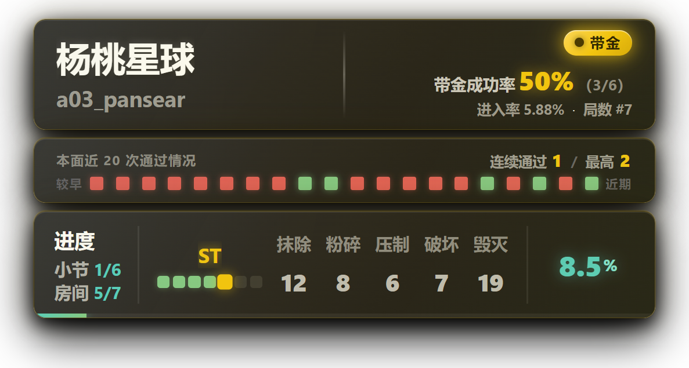
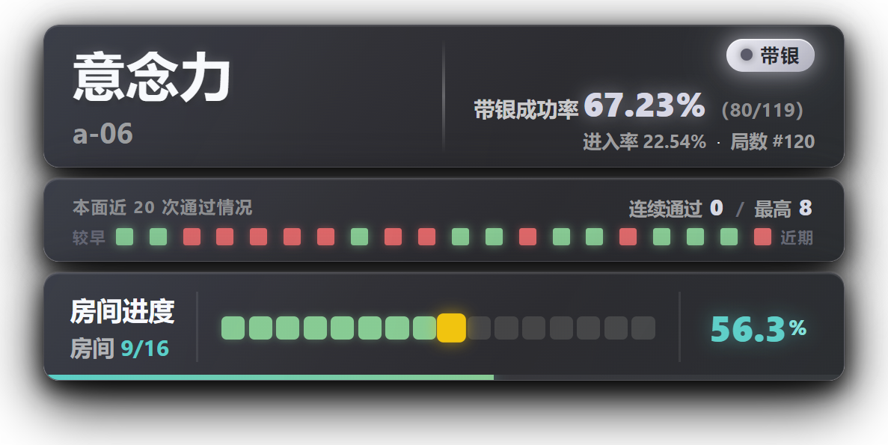
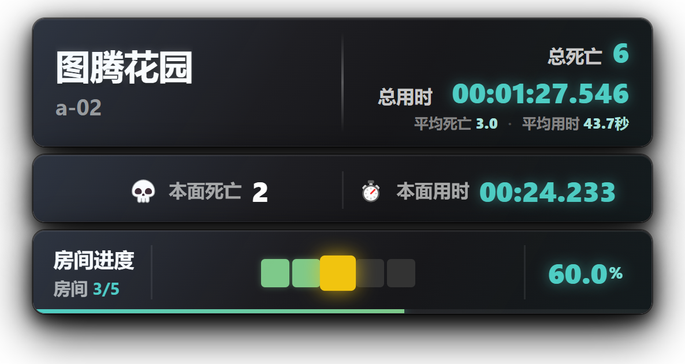
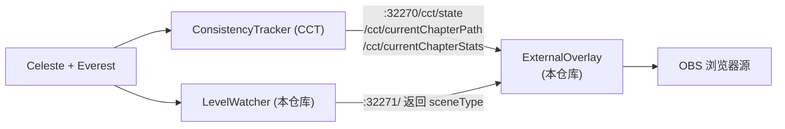

# MapClearingStats


> 蔚蓝（Celeste）实时数据覆盖层
>
> **推图进度**和 **一命挑战（带金/带银）** 二合一
>
> 装饰直播间 / 自己偷偷欣赏 **皆可**！

用于蔚蓝的可视化悬浮层，实时读取游戏内的数据，按当前的项目自动切换两种模式：

**① 一命挑战模式** —— 带起金草莓或银草莓时自动进入，整块面板镀成 金/银 色，  
  
只显示**这一命**的数据：带金成功率、进入率、带金死亡，以及本面最近 20 次的通过情况。

**② 坐牢 推图模式** —— 用方格画出当前攻克进度  
（**绿色 = 已拿下，黄色 = 坐牢中，灰色 = 还没打**），  
并实时显示总死亡、总用时、本面死亡与本面用时。

<div align="center">

| 一命挑战（带金） | 一命挑战（带银） | 推图模式 |
| :---: | :---: | :---: |
|  |  |  |


</div>

## 声明

- 这是本人第一次做蔚蓝的相关工具，制作初心与其说是  
    
  **「制作好用的工具让大家一起来用」**，  
  不如说是  
   **「为自己直播间设计一套推图 / 炼金炼银的 UI，顺便看看有没有其他人用得到」**，  
  有什么设计缺陷还请多多包涵。
- 本工具的功能设计、测试与迭代由 [L\_FLA5H](https://github.com/L-FLA5H) 完成，代码开发由 AI 完成。哥们真的不会写代码。
- 本工具是独立开发的第三方覆盖层，与 Celeste、Everest、ConsistencyTracker 官方无关。
- 本仓库**不包含**任何第三方 Mod 的代码或资源。ConsistencyTracker 的版权归其作者 viddie 所有，你需要自行安装。
- 安装时会覆盖 ConsistencyTracker 自带的同名覆盖层文件，覆盖前请先备份。

## 不想看太多字，只想直接安装？见下方[安装](#安装)部分。

**目录** ｜ [功能介绍](#功能介绍) ・ [安装](#安装) ・ [常见问题](#常见问题-快速自检) ・ [已知局限](#已知局限) ・ [历代版本](#历代版本) ・ [工作原理](#工作原理) ・ [进阶](#进阶) ・ [关于](#关于)

## 功能介绍

**卡片 1 —— 全局信息**

- 地图名
- 当前房间名
- 总死亡数
- 总用时，精确到毫秒

**卡片 2 —— 本面信息**

- 本面死亡数
- 本面用时
- 过图时，定格上一面数据并变色，随后过渡到新房间的数据

**卡片 3 —— 进度方格**

- 多小节地图：只展开玩家当前所在的小节，其余小节显示为房间数
- 单小节地图：一次性铺开所有房间（20 个一行）
- 小节数量过多时，离当前小节越远的小节会越淡
- 已通过的小节显示为绿色
- 换行时最后一行不足的方格会自动并入上一行，避免出现孤零零的一格

### 如果你不直播，只想自己看着玩，可以点界面右下角的「**置顶悬浮**」按钮：

- 覆盖层会变成始终悬浮的小窗口，可以**拖动**、**缩放**
- 再点一下窗口里的「**还原**」，就能回到浏览器页面

> 按钮平时是隐藏的，鼠标移到页面上才会浮出来 —— 直播时观众看不到，非常滴贴心。

> 另外该功能需要 Chrome / Edge 116 或更高版本；  
> 不支持的环境下按钮不会出现（比如OBS 的浏览器源）。  
> 说白了你用Edge都行。

---

**一命挑战模式（带金 / 带银）**

拿起金草莓或银草莓时自动进入，整块面板会镀成金色 / 银色并切换布局：

- **镀色动画** —— 金色 / 银色从卡片左边缘往右扫出；死亡退出时往右扫走并渐隐
- **挑战徽章** —— 右上角显示「带金」/「带银」
- **带金成功率** —— `通过数 / 进入数`，例如 `18.18%（2/11）`
- **进入率** —— 从开头带金到当前面的几率
- **带金死亡** —— 本章累计 + 本次会话
- **本面近 20 次通过情况走势条** —— 20 个方块：绿=通过、红=失败、空心=还没记录；  
  左端「较早」、右端「近期」
- **连续通过 / 最高连续通过**

> ⚠️ 如果想让走势条实时刷新，需要把 CCT 的 `暂停死亡追踪` 设为**关**。  
>   
> 开着的时候 CCT 不记录房间尝试，走势条就不会实时更新。

**状态感知**

- 玩家不在关卡内（主页面、加载中）时，卡片整体模糊并淡入提示文字，不会直接隐藏
- 当前地图没有录制路径时，方格区域会明确提示

> ⚠️ 覆盖层是浏览器页面，**更新文件后要在窗口里按 Ctrl + R** 才会加载新代码。

## 安装

### ⓿ 前置要求

|                      |                                               |
| -------------------- | --------------------------------------------- |
| Celeste              | —— 没蔚蓝你为什么要看这个？                               |
| Everest              | 1.5935.0 或更高版本（见 `LevelWatcher/everest.yaml`） |
| [ConsistencyTracker] | 即 CCT，必装。本工具的数据全部来自它。太伟大了。                    |

> **对电脑配置0要求** —— 能打开浏览器就行。能看到这行字就行。  
> 我不信你电脑打不开浏览器。

  


### ① 安装 LevelWatcher

下载 [Release](https://github.com/L-FLA5H/MapClearingStats/releases/latest) 里的 `LevelWatcher.zip`，然后将其 <big>**解压**</big> 到蔚蓝的Mod文件夹。

蔚蓝的 Mod 通常不用解压，**本工具其实也支持直接丢 zip**，

- 但这里**推荐解压**，原因有二：

1. 出问题时能**直接看到文件**，确认版本对不对、有没有装重复
2. 不用去翻 Everest 的缓存目录（zip 加载的 Mod 会被解压到 `Mods\Cache\`）

**解压后的目录预览**

```
<Celeste 安装目录>\Mods\LevelWatcher\
├── everest.yaml
└── bin\
    ├── LevelWatcher.dll
    └── LevelWatcher.pdb
```

> 常见的装错方式：  
> ① 解压成 `Mods\LevelWatcher\LevelWatcher\everest.yaml`。  
> 多套了一层，Everest 找不到。嘻嘻。  
>   
> ② `everest.yaml` 没有和 `bin` 文件放在一层里。   <del>分清自己的阶层</del>

启动游戏，在 Everest 的 Mod 列表里确认 `LevelWatcher` 已经加载。日志里会出现：

```
[LevelWatcher] LevelWatcher loaded on http://localhost:32271/
```

**就完成第一步了！（走你）**  
  


> 如果你想自己从源码编译，见下方[自己编译 LevelWatcher](#自己编译-levelwatcher)。

  


### ② 配置覆盖层（UI）页面

将 zip 里的 `ExternalOverlay` 文件夹**整个覆盖**到 CCT 的覆盖层目录：

```
<Celeste 安装目录>\ConsistencyTracker\external-tools\ExternalOverlay\
```

注意：这个路径是CCT创建的<big> **外边** </big>的路径，和Mod文件夹同级，  
  
<big>你不用去 <big>**解压CCT然后改文件**</big> ，如果你知道解压是什么的话。</big>  
  


覆盖完之后，目录里应该是这些文件（**数量会随版本变化，以 zip 里的为准**）：

| 文件                | 搞么子的？           |
| ----------------- | --------------- |
| `CCTOverlay.html` | 页面结构            |
| `CCTOverlay.js`   | 主逻辑             |
| `CCTOverlay.css`  | 样式              |
| `Timing.js`       | 房间用时计时模块        |
| `img/`            | CCT 自带的图片资源，不动它 |

> ⚠️ **要整个文件夹一起覆盖，别只挑几个文件。我真给别人解决过这个问题。**

> ⚠️ **找不到这个目录？** 如果你是第一次装 CCT，**先启动一次游戏**。  
>   
>  CCT 会在启动时自动创建这个目录，并把自带的覆盖层文件复制进去。

> ⚠️ CCT 自带同名的 `CCTOverlay.html / .js / .css`，这是 CCT 自带的 UI 界面，本工具的主要改动也就在于此，覆盖前请先备份原文件，否则想用回 CCT 自带界面时会找不回来。

  


### ③ 在游戏里录制一次路径

这一步是**必须的**。CCT 需要先知道这张图有多少小节、多少房间、顺序是什么，方格进度才能画出来。  


有关路径录制的相关信息，**请查阅 CCT 的使用说明**，此处不做赘述。

  


### ④ 在直播软件添加浏览器源

以 OBS 为例：

1. 来源 → `+` → **浏览器**
2. 勾选 **本地文件**，选择 `CCTOverlay.html`
3. **宽度 `620`、高度 `400`**（界面最大宽度是 620px，高度按需要增减）
4. 勾选 **透明背景**（`自定义 CSS` 里留空即可，页面本身已经是透明背景）
5. 建议勾选「源不可见时关闭浏览器」以节省资源

界面会出现在画面的**中间偏上**位置，可以自由拖动。  
  
  
  


## 常见问题 快速自检

### **① UI一直显示「CCT 未响应」／「无法获取」**

  


**1. 你 的 CCT   装  了  吗？**

本工具的数据**全部**来自 [ConsistencyTracker]，  
没装的话覆盖层拿不到任何数据。见上方[前置条件](#前置条件)。憋笑。真的有人因为没装CCT连不上的。  
  


**2. Everest 的「调试模式」开了吗？**

**这是最容易忽略的一条。** CCT 的 API 只在 Everest 的调试模式为 **「仅Everest」或「开」** 时  
才对外可用。  
如果设成了「关」，UI就连不上，且不会有任何别的症状，真无语。

> 位置：游戏内 `Everest 设置` → `调试模式` → 选「仅Everest」或「开」

**3. 蔚蓝开了没？**

游戏没开的来了。

**4. 如果以上情况都不对头，先自己测一下 API 通不通**

在你的浏览器打开 <http://localhost:32270/>

- **如果能打开页面** → 说明 API 正常，问题在UI这边。试试去UI界面按 `Ctrl` + `R` 刷新试试。
- **打不开** → 说明 API 不可用，回到上面第 1、2 条

> 第 2、4 条来自 CCT 自带的常见问题：  
>   
> 游戏内 `Mod选项` → `稳定性追踪器` → `常见问题` → `游戏外工具`

---

### **② 我把文件放进了 `Assets\ExternalOverlay\`，但没用？**

**说明你放错地方了。** CCT 的 Mod 包里有**两份**同名文件：

| 位置在哪？                                                               | 它是啥？                         | 对你使用这个工具有用吗？ |
| ------------------------------------------------------------------- | ---------------------------- | ------------ |
| `Mods\...ConsistencyTracker\Assets\ExternalOverlay\` | CCT **自带的原始副本**，只在首次启动时被复制一次 | ❌ **有个蛋**    |
| `<Celeste 安装目录>\ConsistencyTracker\external-tools\ExternalOverlay\` | CCT 运行时复制出来的**工作目录**         | ✅ **有的朋友有的** |

**正确的目录长这样：**

```
D:\Steam\steamapps\common\Celeste\
├── Mods\                          ← 你的Mod都在这。别删了。
│   └── ...ConsistencyTracker.zip  ← 内含 Assets\ExternalOverlay\（别动这个）
└── ConsistencyTracker\            ← ⚠️ 和 Mods 平级，在游戏根目录下
    └── external-tools\
        └── ExternalOverlay\       ← ✅ 覆盖层文件放这里
            ├── CCTOverlay.html
            ├── CCTOverlay.js
            ├── CCTOverlay.css
            └── Timing.js
```

**判断方法**：往上翻一级，看是 `ConsistencyTracker\` 还是 `Assets\`。  
是 `Assets\` 就放错了。  
  
  


---

### ③ 找不到 `external-tools\ExternalOverlay\` 这个目录?

**先启动一次游戏。** CCT 会在启动时自动创建这个目录，并把自带的覆盖层文件复制进去。

如果你已经启动过游戏还是没有，检查：

1. CCT 装好了吗？（在 Everest 的 Mod 列表里能看到 `ConsistencyTracker`）
2. 有没有别的 CCT 版本把目录建在别处了

> 参考：`external-tools` 这个目录名是写死在 CCT 里的（CCT 2.9.8 实测）。

---

  


### ④ 方格进度不显示／提示「当前地图没有录制路径」?

进度方格依赖于 CCT 的**路径**——也就是「这张图的房间按什么顺序通过」。  
  
CCT自带所有官图的预设路径，但**Mod 自制图需要你自己录一次**。

**录制方法：**

1. 进入要记录的第一个房间
2. 打开 CCT 的 `路径记录` 菜单，点 `开始路径记录`
3. 按你的路线把图跑完（需要的话可以用无敌等辅助功能）
4. 在最后一个房间点 `保存路径`；或者通关后自动保存

**你也可以用调试地图录：**

`路径记录` → `通过调试地图开始路径记录` → 按 `F6` 进入调试地图 → 按跑图顺序点所有房间 → `保存路径`

> 有关路径的录制，此处不做详细介绍，详见 CCT 游戏内 `常见问题` → `路径管理`。

---

  


### ⑤ 炼金炼银的近期通过走势条不刷新?

如果遇到这个问题，你需要把 CCT 的 **`暂停死亡追踪`** 设为 **`关`**。

开着的时候 CCT **不记录房间尝试**，走势条就不会更新。  
  
（「始终追踪带金死亡」开着的话，带金数据仍然会被记录。）

> 位置：游戏内 `Mod选项` → `稳定性追踪器` → `暂停死亡追踪` → 选 `关`

---

  


### ⑥ 我更新了覆盖层文件，但界面没变化?

覆盖层是个浏览器页面，**跑的是「打开那一刻的代码」**，不会自动重新加载。

直接点击刷新按钮，或者在UI界面按 **Ctrl + R**，或者关掉窗口重新打开，或者关掉电脑重新打开，或者关掉地球直接打开，或者你自己去睡一觉然后回来直接打开。

---

  


### ⑦ 我想确认数据到底有没有在更新怎么办？

用 `tools/diag.ps1`（Windows 自带 PowerShell，不用额外装东西）：

```powershell
powershell -ExecutionPolicy Bypass -File "tools\diag.ps1" 120
```

它会记录 120 秒内 CCT 数据的变化，输出到 `tools\_diag.txt`。只记变化，所以日志很短。

  


### ⑧ 我找不到「置顶悬浮」按钮?

按钮是**默认隐藏**的，鼠标移到右下角才会浮出来。

但是如果鼠标移上去也没有的话，说明你的浏览器不支持这个功能。  
这个功能需要 **Chrome / Edge 116 或更高版本**。  
  
OBS 的浏览器源同样不支持，所以直播时它也不会出现 —— 这是故意的，不影响直播。

  


### ⑨ 我点了「置顶悬浮」，但是只弹出一个空白窗口/什么也没发生?

大概率是你的浏览器不支持 Document Picture-in-Picture。  
目前已知 **QQ 浏览器（极速内核）** 有这个问题：  
它会打开一个同样的名为**about:blank**的窗口，但并不是你想要的悬浮窗。

**换 Chrome 或 Edge 打开本页面**就好了。

> 如果你习惯用别的浏览器：也可以把覆盖层放在普通窗口里，  
> 然后用 [PowerToys](https://learn.microsoft.com/windows/powertoys/) 的 **Always On Top**（`Win` + `Ctrl` + `T`）把它置顶 —— 效果差不多。

  


### ⑩ 能不能把悬浮窗口改成只有三张卡片，去掉标签栏？

我将用最直白，最不绕弯子，最一针见血，最明了的话告诉你：不行。  
  
**至少目前不行**。  
  
  
标题栏是**浏览器自己画的**，网页改不了，去不掉，而且 Edge 显示的是一长串文件路径。  
但你可以把窗口拖成刚好包住卡片的大小，看起来就没那么多空了。  
  
（拖动窗口边缘时，卡片会**自动缩放**去适应。）

## 已知局限

- **「局数」这个数据拿不到**：CCT 只在拿着金草莓的那一刻短暂提供，没拿时是空的。覆盖层在拿不到时会退回显示「带金死亡」
- **「置顶悬浮」需要 Chrome / Edge 116 或更高版本**（用的是浏览器的 Document Picture-in-Picture）；  
  OBS 的浏览器源和 QQ 浏览器的极速内核不支持。悬浮窗口的标题栏是浏览器画的，去不掉
- **CCT 更新有概率导致本工具异常** —— 数据接口变了就会出问题，遇到请提 issue

## 历代版本

> **v0.4.0** 新增**置顶悬浮**功能（不直播时用的置顶小窗口，可拖动缩放）；  
>   
> 进度方格改进（小节多时逐渐淡出、已通过标绿、方格不再被压成小圆点、百分比占位缩小）；  
>   
> 修了「带金时第三张卡片没变金」的问题。  
>   
> 详见 [Release notes](docs/release-notes-v0.4.0.md)。

> **v0.3.1** 是内部重构 + 文档补充，  
> **没有用户可见的变化**（计时逻辑收敛到 `Timing.js`，主循环拆成六步管道）。  
>   
> 详见 [Release notes](docs/release-notes-v0.3.1.md)。

> **v0.3.0** 新增了**一命挑战模式（带金 / 带银）**，并重做模糊层，修了一批动画与数据刷新的问题。  
>   
> 详见 [Release notes](docs/release-notes-v0.3.0.md)。  
>   

> **v0.2.0** 集中修复了此前 README 列出的 6 个计时 bug  
> （保存退出、重新开始此章节、  
> 返回地图选不保存进度、换图时间虚高等）。  
> 详见 [Release notes](docs/release-notes-v0.2.0.md)。

## 工作原理

本工具本身**不修改游戏、不读取存档**，它只是一个前端页面，轮询两个本地 HTTP 接口：



- **ConsistencyTracker** 负责真正把数据抓出来：玩家在哪个房间、每个房间的死亡数、每个房间的用时，以及这张图的完整小节 / 房间顺序等。本工具只是展示它已经算好的数据。  

- **LevelWatcher** 是本仓库附带的一个极简 Mod（约 80 行 C#）。它唯一的功能是在本机 `32271` 端口返回当前场景类型（`Celeste.Level` 还是 `Celeste.Overworld`）。因为 CCT 在玩家退出地图后会把状态冻结在最后一帧，前端只靠 CCT 无法判断玩家在不在地图里，所以需要它来补齐这一块。

> 本仓库不包含 ConsistencyTracker 或任何其他第三方 Mod 的代码。CCT 是独立的依赖 Mod，需要你自行安装。

### 本工具和 CCT 自带的窗口是什么关系?

**CCT 本身就带一个外置窗口** —— 就是游戏内设置里的「游戏外展示窗口」。  
  
它可以把统计数据渲染成一张网页，让你能在浏览器或 OBS 的那种地方里看。


**本工具本质上就是把那个窗口换了一种（也许更好看的）形式。**  
  
同样是读 CCT 的数据，只是重新设计了布局和样式，  
  
另外加了一些 CCT 自带窗口没有的东西（进度方格、走势条、一命挑战模式）。

所以你可以理解成：**它是 CCT 外置窗口的一个「皮肤 + 增强版」**，不是独立的软件。

> **配置要求：无。** 只要你的电脑能打开浏览器，就能用。  
> 不需要额外装运行时、不需要开服务、对显卡也没有额外要求。如果你有多余5090也可以寄给我，我没意见。

---

## 进阶

如果你只是普通用户，就可以不用看这一部分了！下面这些是**想折腾的时候才需要**的，正常用不到。

| 这是啥                    | where                                                      |
| ---------------------- | ---------------------------------------------------------- |
| 排查工具（抓数据用）             | [`tools/`](tools/) —— 见 [tools/README.md](tools/README.md) |
| CCT 接口速查（字段名 / 单位 / 坑） | [`docs/cct-api-notes.md`](docs/cct-api-notes.md)           |
| 历史版本说明                 | [`docs/release-notes-*.md`](docs/)                         |

### 自己编译 LevelWatcher

需要 .NET 8 SDK。把 `LevelWatcher` 文件夹放进 `<Celeste 安装目录>\Mods\` 后：

```bash
cd <Celeste 安装目录>\Mods\LevelWatcher\Source
dotnet build
```

编译产物会自动复制到 `LevelWatcher\bin\`。Release 配置下还会额外打包出 `LevelWatcher.zip`：

```bash
dotnet build -c Release
```

如果不想把项目放进 Mods 目录，也可以手动指定蔚蓝的安装路径：

```bash
dotnet build -p:CelestePrefix="D:\Steam\steamapps\common\Celeste"
```

---

## 关于

### 致谢

- Everest —— 蔚蓝的 Mod 加载器与 API，本工具运行的基础
- ConsistencyTracker —— 数据来源。没有它，本工具无法得知房间列表与逐房间的死亡 / 用时

### 许可

[MIT](LICENSE) © L_FLA5H
