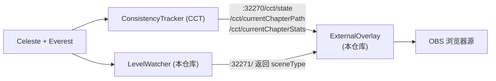

# MapClearingStats

[](https://github.com/L-FLA5H/MapClearingStats/releases/latest)
[](LICENSE)

> 蔚蓝（Celeste）直播用 实时数据覆盖层
> 
> **推图进度**和 **一命挑战（带金/带银）** 二合一

用于蔚蓝直播的可视化悬浮层，实时读取游戏内的实时数据，按当前的项目自动切换两种模式：

**推图模式** —— 用方格画出当前攻克进度（**绿色 = 已拿下，黄色 = 坐牢中，灰色 = 还没打**），
并实时显示总死亡、总用时、本面死亡与本面用时。

**一命挑战模式** —— 带起金草莓或银草莓时自动进入，整块面板「镀」成金色 / 银色，
只显示**这一命**的数据：带金成功率、进入率、带金死亡，以及本面最近 20 次的通过情况。

**[⬇ 下载最新版](https://github.com/L-FLA5H/MapClearingStats/releases/latest)** —— 装法见下方[安装](#安装)。

| 一命挑战（带金） | 一命挑战（带银） | 推图模式 |
| :---: | :---: | :---: |
|  |  |  |

---

## 注意事项

- 这是本人第一次做蔚蓝的相关工具，制作初心与其说是 **「制作好用的工具让大家一起来用」** ，不如说是 **「为自己直播间设计一套推图 / 炼金炼银的 UI，顺便看看有没有其他人用得到」** ，有什么设计缺陷还请多多包涵。
- 本工具包含一个用于抓取游戏状态的单独 mod（[LevelWatcher](LevelWatcher/)）和几个可视化文件，本质上是对 CCT (ConsistencyTrackerMod) 中的悬浮层文件进行了修改。如要使用本工具，你需要先在任意的蔚蓝mod管理工具中安装 CCT。
- 本工具的功能设计、测试与迭代由 [L_FLA5H](https://github.com/L_FLA5H) 完成，代码开发由 AI 完成。
- 如果 CCT 更新导致本工具出现异常，我会尽快修复。
- 覆盖层是浏览器页面：更新文件之后要在窗口里按 `Ctrl + R` 重新加载，否则跑的还是旧代码。

## 功能

**卡片 1 —— 全局信息**

- 地图名
- 当前房间名
- 总死亡数（每次死亡缩放 + 略微变红）
- 精确到毫秒的总用时

**卡片 2 —— 本面信息**

- 本面的死亡数
- 本面的用时
- 过图时，定格上一面数据并变色，随后用「先快后慢」的缓动动画过渡到新房间的数据

**卡片 3 —— 进度方格**

- 多小节地图：只展开玩家当前所在的小节，其余小节显示为房间数
- 单小节地图：整张图的房间一次性铺开（20 个一行）
- 小节数量过多时自动缩放：离当前小节越远越小，始终把当前位置放在视觉重心
- 换行时最后一行不足的方格会自动并入上一行，避免出现孤零零的一格

**一命挑战模式（带金 / 带银）**

拿起金草莓或银草莓时自动进入，整块面板会「镀」成金色 / 银色并切换布局：

- **镀色动画** —— 金色 / 银色从卡片左边缘往右扫上来；死亡退出时往右扫走并渐隐
- **挑战徽章** —— 右上角显示「带金」/「带银」
- **带金成功率** —— `通过数 / 进入数`，例如 `18.18%（2/11）`
- **进入率** —— 从开头带金到当前面的几率
- **带金死亡** —— 本章累计 + 本次会话
- **本面近 20 次通过情况走势条** —— 20 个方块：绿=通过、红=失败、空心=还没记录；
  左端「较早」、右端「近期」
- **连续通过 / 最高连续通过**

> ⚠️ 如果想让走势条实时刷新，需要把 CCT 的 `暂停死亡追踪` 设为**关**。
> 开着的时候 CCT 不记录房间尝试，走势条就不会更新。

**状态感知**

- 玩家不在关卡内（主页面、加载中）时，卡片整体模糊并淡入提示文字，不会直接隐藏
- 模糊层边缘羽化处理，不会出现硬方框边
- 当前地图没有录制路径时，方格区域会明确提示

> ⚠️ 覆盖层是浏览器页面，**更新文件后要在窗口里按 `Ctrl + R`** 才会加载新代码。

---

## 工作原理

本工具本身**不修改游戏、不读取存档**，它只是一个前端页面，轮询两个本地 HTTP 接口：



- **ConsistencyTracker** 负责真正把数据抓出来：玩家在哪个房间、每个房间的死亡数、每个房间的用时，以及这张图的完整小节 / 房间顺序。本工具只是展示它已经算好的数据。
- **LevelWatcher** 是本仓库附带的一个极简 Mod（约 80 行 C#）。它唯一的功能是在本机 `32271` 端口返回当前场景类型（`Celeste.Level` 还是 `Celeste.Overworld`）。因为 CCT 在玩家退出地图后会把状态冻结在最后一帧，前端只靠 CCT 无法判断玩家在不在地图里，所以需要它来补齐这一块。

> 本仓库不包含 ConsistencyTracker 或任何其他第三方 Mod 的代码。CCT 是独立的依赖 Mod，需要你自行安装。

---

## 安装

### 前置条件

| 项目 | 说明 |
| --- | --- |
| Celeste | Steam / itch.io 版本均可 |
| Everest | 1.5935.0 或更高版本（见 `LevelWatcher/everest.yaml`） |
| [ConsistencyTracker] | 即 CCT，必装。本工具的数据全部来自它 |

### 第 1 步：安装 LevelWatcher

下载 [Release](https://github.com/L-FLA5H/MapClearingStats/releases/latest) 里的 `LevelWatcher.zip`，解压到蔚蓝的 Mods 目录：

```
<Celeste 安装目录>\Mods\LevelWatcher\
```

启动游戏，在 Everest 的 Mod 列表里确认 `LevelWatcher` 已经加载。日志里会出现：

```
[LevelWatcher] LevelWatcher loaded on http://localhost:32271/
```

> 想自己从源码编译的话，见下方[自己编译 LevelWatcher](#自己编译-levelwatcher)。

### 第 2 步：配置覆盖层页面

将 `ExternalOverlay` 里的 **3 个文件**覆盖到 CCT 的覆盖层目录：

```
<Celeste 安装目录>\ConsistencyTracker\external-tools\ExternalOverlay\
```

> ⚠️ CCT 自带同名的 `CCTOverlay.html / .js / .css`，这是 CCT 自带的 UI 界面，本工具的主要改动也就在于此，覆盖前请先备份原文件，否则想用回 CCT 自带界面时会找不回来。

### 第 3 步：在游戏里录制一次路径

这一步是**必须的**。CCT 需要先知道这张图有多少小节、多少房间、顺序是什么，方格进度才能画出来。
有关路径录制的相关信息请查阅 CCT 的使用说明，此处不做赘述。

### 第 4 步：在直播软件添加浏览器源

以 OBS 为例：

1. 来源 → `+` → **浏览器**
2. 勾选 **本地文件**，选择 `CCTOverlay.html`
3. **宽度 `620`、高度 `400`**（界面最大宽度是 620px，高度按需要增减）
4. 勾选 **透明背景**（`自定义 CSS` 里留空即可，页面本身已经是透明背景）
5. 建议勾选「源不可见时关闭浏览器」以节省资源

界面会出现在画面的**中间偏上**位置，可以自由拖动。

---

## 自己编译 LevelWatcher

需要 .NET 8 SDK。把 `LevelWatcher` 文件夹放进 `<Celeste 安装目录>\Mods\` 后：

```bash
cd <Celeste 安装目录>\Mods\LevelWatcher\Source
dotnet build
```

编译产物会自动复制到 `LevelWatcher\bin\`。Release 配置下还会额外打包出 `LevelWatcher.zip`：

```bash
dotnet build -c Release
```

如果不想把项目放进 Mods 目录，也可以手动指定蔚蓝的安装路径：

```bash
dotnet build -p:CelestePrefix="D:\Steam\steamapps\common\Celeste"
```

## 常见问题

### 覆盖层一直显示「CCT 未响应」／「无法获取」

这是最常见的反馈，按顺序排查：

**1. CCT 装了吗？**

本工具的数据**全部**来自 [ConsistencyTracker]，没装的话覆盖层拿不到任何数据。见上方[前置条件](#前置条件)。

**2. Everest 的「调试模式」开了吗？** ⚠️ **最容易忽略的一条**

CCT 的 API 只在 Everest 的调试模式为 **「仅Everest」或「开」** 时才对外可用。
如果设成了「关」，覆盖层**永远**连不上，且不会有任何别的症状。

> 位置：游戏内 `Everest 设置` → `调试模式` → 选「仅Everest」或「开」

**3. 游戏在运行吗？**

覆盖层是从游戏进程里读数据的。游戏没开，就没有数据。

**4. 自己测一下 API 通不通**

浏览器打开 <http://localhost:32270/>

- **能打开页面** → API 正常，问题在覆盖层这边。试试在覆盖层窗口按 `Ctrl + R`
- **打不开** → API 不可用，回到上面第 1、2 条

> 第 2、4 条来自 CCT 自带的常见问题：
> 游戏内 `Mod选项` → `稳定性追踪器` → `常见问题` → `游戏外工具`

---

### 方格进度不显示／提示「当前地图没有录制路径」

进度方格依赖 CCT 的**路径**——也就是「这张图的房间按什么顺序通过」。
原版地图自带预设路径，**Mod 自制图需要自己录一次**。

**录制方法（游戏内）：**

1. 进入要记录的第一个房间
2. 打开 CCT 的 `路径记录` 菜单，点 `开始路径记录`
3. 像正常一样把图跑完（需要的话可以用无敌等辅助功能）
4. 在最后一个房间点 `保存路径`；或者通关后会自动保存

**也可以用调试地图录：**

`路径记录` → `通过调试地图开始路径记录` → 按 `F6` 进入调试地图 → 按跑图顺序点所有房间 → `保存路径`

> 详见 CCT 游戏内 `常见问题` → `路径管理`

---

### 走势条不刷新

需要把 CCT 的 **`暂停死亡追踪`** 设为 **`关`**。

开着的时候 CCT **不记录房间尝试**，走势条就不会更新。
（「始终追踪带金死亡」开着的话，带金数据仍然会被记录。）

> 位置：游戏内 `Mod选项` → `稳定性追踪器` → `暂停死亡追踪` → 选 `关`

---

### 更新了覆盖层文件，但界面没变化

覆盖层是个浏览器页面，**跑的是「打开那一刻的代码」**，不会自动重新加载。

在覆盖层窗口按 **`Ctrl + R`**，或者关掉窗口重新打开。

---

### 我想确认数据到底有没有在更新

用 `tools/diag.ps1`（Windows 自带 PowerShell，不用装东西）：

```powershell
powershell -ExecutionPolicy Bypass -File "tools\diag.ps1" 120
```

它会记录 120 秒内 CCT 数据的变化，输出到 `tools\_diag.txt`。只记变化，所以日志很短。

## 已知局限

- 方格进度依赖 CCT 的路径录制，没录过路径的地图只会显示提示文字，不会出错
- 数据存在浏览器本地（`localStorage`），关掉浏览器再打开也还在（v0.2.0 之前用的是 `sessionStorage`，关标签页就清空）
- **「局数」这个数据拿不到**：CCT 只在拿着金草莓的那一刻短暂提供，没拿时是空的。覆盖层在拿不到时会退回显示「带金死亡」
- **如果想要走势条实时刷新**，需要把 CCT 的「暂停死亡追踪」设为**关**（开着的时候 CCT 不记录房间尝试）

> v0.3.0 新增了**一命挑战模式（带金 / 带银）**，并重做模糊层，修了一批动画与数据刷新的问题。
> 详见 [Release notes](docs/release-notes-v0.3.0.md)。
>
> v0.2.0 集中修复了此前 README 列出的 6 个计时 bug（保存退出、重新开始此章节、
> 返回地图选不保存进度、换图时间虚高等）。详见 [Release notes](docs/release-notes-v0.2.0.md)。
## 目录结构

```
MapClearingStats/
├── ExternalOverlay/          # 前端覆盖层，覆盖到 CCT 的 external-tools/ExternalOverlay/
│   ├── CCTOverlay.html
│   ├── CCTOverlay.js
│   └── CCTOverlay.css
├── LevelWatcher/             # 辅助 Mod，放进 Mods/
│   ├── everest.yaml
│   ├── LevelWatcher.sln
│   └── Source/
│       ├── LevelWatcher.csproj
│       ├── LevelWatcherModule.cs
│       ├── LevelWatcherModuleSettings.cs
│       ├── LevelWatcherModuleSession.cs
│       └── LevelWatcherModuleSaveData.cs
├── docs/                     # 文档与截图
│   ├── cct-api-notes.md          # CCT 接口速查（字段 / 单位 / 坑）
│   ├── preview-normal.png        # 推图模式预览
│   ├── preview-gold.png          # 带金模式预览
│   ├── preview-silver.png        # 带银模式预览
│   ├── release-notes-v0.1.0.md
│   ├── release-notes-v0.2.0.md
│   └── release-notes-v0.3.0.md
├── tools/                    # 排查与自检工具（见 tools/README.md）
│   ├── diag.ps1                  # 记录 CCT 数据变化（不用装东西）
│   ├── diagnose.html             # 浏览器版诊断页
│   ├── check-anim.js             # 覆盖层自动化自检（31 条断言）
│   ├── cct-dump.js               # 一次性打印所有 CCT 字段
│   └── deploy-overlay.ps1        # 部署到游戏目录（备份 + 校验）
├── 改动表.md                 # 按版本记录的改动摘要
├── LICENSE
└── README.md
```

---

## 致谢

- [Everest] —— 蔚蓝的 Mod 加载器与 API，本工具运行的基础
- [ConsistencyTracker] —— 数据来源。没有它，本工具无法得知房间列表与逐房间的死亡 / 用时

## 声明

- 本工具是独立开发的第三方覆盖层，与 Celeste、Everest、ConsistencyTracker 官方无关。
- 本仓库**不包含**任何第三方 Mod 的代码或资源。ConsistencyTracker 的版权归其作者 viddie 所有，需自行安装。
- 安装时会覆盖 ConsistencyTracker 自带的同名覆盖层文件，覆盖前请先备份。

## 许可

[MIT](LICENSE) © L_FLA5H

<!-- 引用式链接的定义（正文里用 [Everest] / [ConsistencyTracker] 引用） -->
[Everest]: https://github.com/EverestAPI/Everest
[ConsistencyTracker]: https://github.com/viddie/ConsistencyTrackerMod
