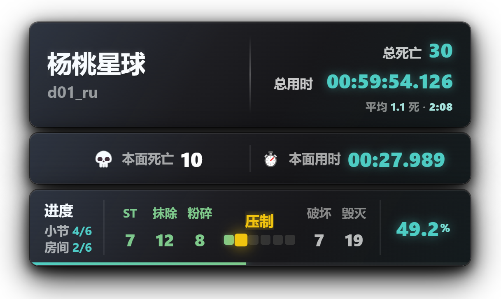
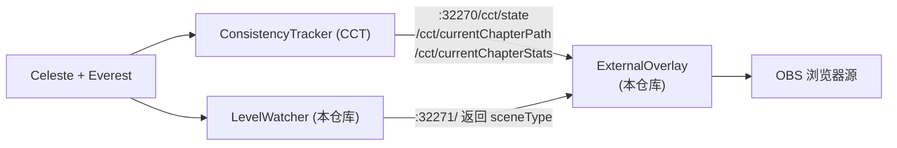

# MapClearingStats

[](https://github.com/L-FLA5H/MapClearingStats/releases/latest)
[](LICENSE)

> 蔚蓝（Celeste）直播用「推图」实时数据统计覆盖层
> 一眼看清还有多少没打完

一个给蔚蓝推图直播准备的可视化悬浮层，它会实时读取游戏内的死亡数与用时，用方格形式把当前的攻克进度画出来：**绿色 = 已拿下，黄色 = 坐牢中，灰色 = 还没打**。

**[⬇ 下载最新版](https://github.com/L-FLA5H/MapClearingStats/releases/latest)** —— 装法见下方[安装](#安装)。



---

## 注意事项

- 这是本人第一次做蔚蓝的相关工具，制作初心与其说是「制作好用的工具让大家一起来用」，不如说是「为自己直播间设计一个推图 UI，顺便看看有没有其他人用得到」，有什么设计缺陷还请多多包涵。
- 本工具包含一个用于抓取游戏状态的单独 mod（[LevelWatcher](LevelWatcher/)）和几个可视化文件，本质上是对 CCT (ConsistencyTrackerMod) 中的悬浮层文件进行了修改。如要使用本工具，你需要先在任意的蔚蓝mod管理工具中安装 CCT。
- 本工具的功能设计、测试与迭代由 [L_FLA5H](https://github.com/L_FLA5H) 完成，代码开发由 AI 完成。
- 本工具目前存在一些计时逻辑上的问题，详见下方[缺陷](#缺陷)一节。
- 如果 CCT 更新导致本工具出现异常，我会尽快修复。

## 功能

**卡片 1 —— 全局信息**

- 地图名
- 当前房间名
- 总死亡数（每次死亡有缩放 + 微微变红的动画）
- 精确到毫秒的总用时

**卡片 2 —— 本面信息**

- 本面的死亡数
- 本面的用时
- 过图时，定格上一面数据并变色，随后用「先快后慢」的缓动动画过渡到新房间的数据

**卡片 3 —— 进度方格**

- 多小节地图：只展开玩家当前所在的小节，其余小节显示为房间数
- 单小节地图：整张图的房间一次性铺开（20 个一行）
- 小节数量过多时自动缩放：离当前小节越远越小，始终把当前位置放在视觉重心
- 换行时最后一行不足的方格会自动并入上一行，避免出现孤零零的一格

**状态感知**

- 玩家不在关卡内（主页面、加载中）时，卡片整体模糊并淡入提示文字，不会直接隐藏
- 当前地图没有录制路径时，方格区域会明确提示

---

## 工作原理

本工具本身**不修改游戏、不读取存档**，它只是一个前端页面，轮询两个本地 HTTP 接口：



- **ConsistencyTracker** 负责真正把数据抓出来：玩家在哪个房间、每个房间的死亡数、每个房间的用时，以及这张图的完整小节 / 房间顺序。本工具只是展示它已经算好的数据。
- **LevelWatcher** 是本仓库附带的一个极简 Mod（约 80 行 C#）。它唯一的功能是在本机 `32271` 端口返回当前场景类型（`Celeste.Level` 还是 `Celeste.Overworld`）。因为 CCT 在玩家退出地图后会把状态冻结在最后一帧，前端只靠 CCT 无法判断玩家在不在地图里，所以需要它来补齐这一块。

> 本仓库不包含 ConsistencyTracker 或任何其他第三方 Mod 的代码。CCT 是独立的依赖 Mod，需要你自行安装。

---

## 安装

### 前置条件

| 项目 | 说明 |
| --- | --- |
| Celeste | Steam / itch.io 版本均可 |
| Everest | 1.5935.0 或更高版本（见 `LevelWatcher/everest.yaml`） |
| [ConsistencyTracker] | 即 CCT，必装。本工具的数据全部来自它 |

### 第 1 步：安装 LevelWatcher

下载 [Release](https://github.com/L-FLA5H/MapClearingStats/releases/latest) 里的 `LevelWatcher.zip`，解压到蔚蓝的 Mods 目录：

```
<Celeste 安装目录>\Mods\LevelWatcher\
```

启动游戏，在 Everest 的 Mod 列表里确认 `LevelWatcher` 已经加载。日志里会出现：

```
[LevelWatcher] LevelWatcher loaded on http://localhost:32271/
```

> 想自己从源码编译的话，见下方[自己编译 LevelWatcher](#自己编译-levelwatcher)。

### 第 2 步：配置覆盖层页面

将 `ExternalOverlay` 里的 **3 个文件**覆盖到 CCT 的覆盖层目录：

```
<Celeste 安装目录>\ConsistencyTracker\external-tools\ExternalOverlay\
```

> ⚠️ CCT 自带同名的 `CCTOverlay.html / .js / .css`，这是 CCT 自带的 UI 界面，本工具的主要改动也就在于此，覆盖前请先备份原文件，否则想用回 CCT 自带界面时会找不回来。

### 第 3 步：在游戏里录制一次路径

这一步是**必须的**。CCT 需要先知道这张图有多少小节、多少房间、顺序是什么，方格进度才能画出来。
有关路径录制的相关信息请查阅 CCT 的使用说明，此处不做赘述。

### 第 4 步：在直播软件添加浏览器源

以 OBS 为例：

1. 来源 → `+` → **浏览器**
2. 勾选 **本地文件**，选择 `CCTOverlay.html`
3. **宽度 `620`、高度 `400`**（界面最大宽度是 620px，高度按需要增减）
4. 勾选 **透明背景**（`自定义 CSS` 里留空即可，页面本身已经是透明背景）
5. 建议勾选「源不可见时关闭浏览器」以节省资源

界面会出现在画面的**中间偏上**位置，可以自由拖动。

---

## 自己编译 LevelWatcher

需要 .NET 8 SDK。把 `LevelWatcher` 文件夹放进 `<Celeste 安装目录>\Mods\` 后：

```bash
cd <Celeste 安装目录>\Mods\LevelWatcher\Source
dotnet build
```

编译产物会自动复制到 `LevelWatcher\bin\`。Release 配置下还会额外打包出 `LevelWatcher.zip`：

```bash
dotnet build -c Release
```

如果不想把项目放进 Mods 目录，也可以手动指定蔚蓝的安装路径：

```bash
dotnet build -p:CelestePrefix="D:\Steam\steamapps\common\Celeste"
```

## 缺陷

- 方格进度依赖 CCT 的路径录制，没录过路径的地图只会显示提示文字
- 数据存在浏览器会话里（`sessionStorage`），关掉浏览器后清空，不做跨会话的历史统计
- 存在一些计时逻辑上的问题：蔚蓝中的地图状态实在太多，你可以**保存退出**、**重新开始此章节**、如果是合集图也许还能**返回地图但保存进度**，因此几乎不可能只靠我自己就将这些场景全部覆盖。本人已经尽力处理了大部分日常情况，但使用过程中仍可能遇到bug，届时请告知本人！感谢你的支持！

---

## 目录结构

```
MapClearingStats/
├── ExternalOverlay/          # 前端覆盖层，覆盖到 CCT 的 external-tools/ExternalOverlay/
│   ├── CCTOverlay.html
│   ├── CCTOverlay.js
│   └── CCTOverlay.css
├── LevelWatcher/             # 辅助 Mod，放进 Mods/
│   ├── everest.yaml
│   ├── LevelWatcher.sln
│   └── Source/
│       ├── LevelWatcher.csproj
│       ├── LevelWatcherModule.cs
│       ├── LevelWatcherModuleSettings.cs
│       ├── LevelWatcherModuleSession.cs
│       └── LevelWatcherModuleSaveData.cs
├── docs/                     # 文档与截图
│   ├── screenshot.png
│   └── release-notes-v0.1.0.md
├── LICENSE
└── README.md
```

---

## 致谢

- [Everest] —— 蔚蓝的 Mod 加载器与 API，本工具运行的基础
- [ConsistencyTracker] —— 数据来源。没有它，本工具无法得知房间列表与逐房间的死亡 / 用时

## 声明

- 本工具是独立开发的第三方覆盖层，与 Celeste、Everest、ConsistencyTracker 官方无关。
- 本仓库**不包含**任何第三方 Mod 的代码或资源。ConsistencyTracker 的版权归其作者 viddie 所有，需自行安装。
- 安装时会覆盖 ConsistencyTracker 自带的同名覆盖层文件，覆盖前请先备份。

## 许可

[MIT](LICENSE) © L_FLA5H
